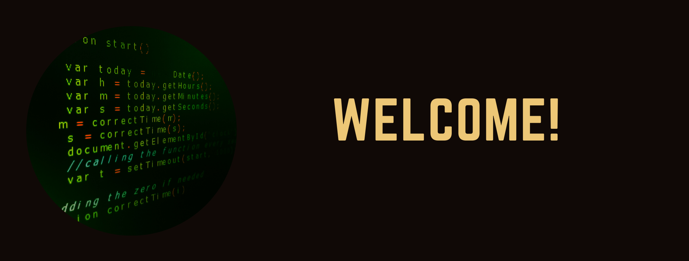

## Hi 👋

Soy <a href="https://github.com/SebastianMM-96">Sebastián Marroquin</a>, actualmente estudiando en <a href="http://www.cua.uam.mx/">UAM-C</a> y aspirante a convertirme en un experto en Data Scientist utilizando <a href="https://www.python.org/">Python</a>.

Mis intereses son:

- Data Scientist
- Python 
- Machine learning
- Front-End

Actualmente estoy tomando los cursos de:

- Foundations of Data Science: K-Means Clustering in Python (Universidad de Londres & Goldsmiths, University of London)
- HTML, CSS, and Javascript for Web Developers (Universidad Johns Hopkins)
- Cryptography (Universidad de Stanford)

## :rocket: Algunos lenguajes de programación

||||||

## 🌱 Actualmente estoy aprendiendo...

- React.js
- Back-end
